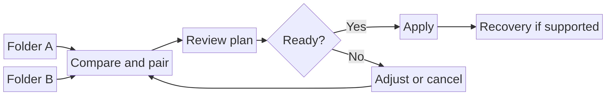
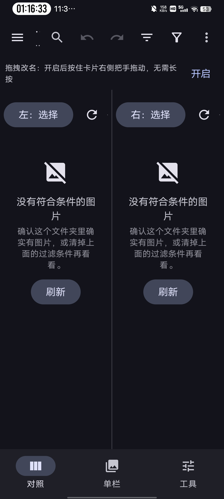

# PairRename

### See both sides. Pair with evidence. Rename with care.

> **「先看清对应关系，再安心整理图片。」**

[](https://github.com/aWorlding1/pairrename-android/actions/workflows/ci.yml) [](https://github.com/aWorlding1/pairrename-android/releases) [](LICENSE)

[English](#why-pairrename) · [中文](#pairrename-中文说明)

PairRename is a local-first Android photo workbench for reconciling two related sets—camera originals and edited exports, for example. Two panes keep the images, not only their filenames, in view while you compare, review suggested pairings, and approve changes.

A bulk rename should never have to feel like a guess. PairRename aims to make relationships visible, suggestions reviewable, and file operations understandable before they happen. **The final decision stays with the person who owns the photos.**

## Why PairRename?

When a photo set has been copied, edited, or reorganized, matching files by filename alone can be unreliable. PairRename puts both sides on screen and gives you room to check the relationship before changing a name.

- **Compare side by side** — browse two folders, preview images, and inspect file details in one workspace.
- **Pair with context** — match by tapping, drag-and-drop, or order; review suggestions informed by filenames, numbering, capture time/EXIF, dimensions, and other available evidence.
- **Review before applying** — inspect the proposed mapping and conflicts before a batch rename or supported organization workflow.
- **Keep a recovery path** — use operation history, undo/redo, and in-app trash/recovery where the selected storage provider supports them.
- **Make the workspace yours** — filter, sort, select, inspect duplicates or mismatches, and use tablet/keyboard-friendly navigation.

## Workflow at a glance



*Workflow illustration—not an in-app screenshot.*

<details>
<summary>View the actual Chinese interface screenshot (empty state)</summary>



*This is a user-provided capture of the running app. The app version is not visible in the screenshot; both folder panes are unselected, so it demonstrates the workspace layout rather than a completed pairing session.*
</details>

For the product's safety and privacy commitments, see [Project Principles](docs/PROJECT_PRINCIPLES.md). Feature availability can vary by Android version and storage provider; review each plan and try unfamiliar workflows on copies first.

## Download and get started

**Current release:** `v6.2.3` · `versionCode 61` · Android 8.0+ (API 26+)

1. Get the signed APK and its SHA-256 file from [GitHub Releases](https://github.com/aWorlding1/pairrename-android/releases).
2. Verify the APK against `PairRename-v6.2.3-SHA256SUMS.txt` before installing. Install only software from a source you trust.
3. Choose the left and right folders through Android's system folder picker, granting access only to the folders you intend to manage.
4. Compare the images, review suggested matches, then inspect the rename plan and conflicts before applying it.

> **A careful first run:** use a small copy of your photos. In-app history and trash are safeguards—not a backup.

## Build from source

Requirements: Android Studio or Android SDK, JDK 17, and the Android SDK platform/build tools for API 35. The Gradle wrapper downloads Gradle 8.9 on first use.

```bash
git clone https://github.com/aWorlding1/pairrename-android.git
cd pairrename-android
./gradlew :app:assembleDebug
```

The debug APK is written to `app/build/outputs/apk/debug/`. On Windows, use `gradlew.bat :app:assembleDebug`.

To create a signed release build, provide **your own** signing key through the ignored `app/keystore.properties` file or the `PAIRRENAME_*` environment variables described in `app/keystore.properties.example`. Never commit or share a private signing key or its passwords. A build signed with your key is not update-compatible with builds signed by another key.

### Run the source-level checks

These checks do not require an Android SDK or Gradle. They exercise source-level invariants; they do not replace Android builds, device testing, or storage-provider testing.

```bash
./verify_all.sh
```

## Version and validation

The latest tagged release is **v6.2.3 (versionCode 61)**. The live CI badge above tracks the default-branch workflow; use [workflow history](https://github.com/aWorlding1/pairrename-android/actions/workflows/ci.yml) to inspect current runs and their exact jobs rather than relying on a hard-coded run number. The separately distributed Release APK's package/version metadata match the tagged source, and its APK Signature Scheme v2 signature verifies. This is a signature/metadata check, not a reproducible source-to-binary build. See the [build and verification guide](docs/BUILDING_AND_VERIFICATION.md) for commands and limits.

Project-supplied notes report installation and interaction checks on a MuMu Android 15 emulator, including repeated drag/drop after the duplicate-list-key fix. That report is attributed to the project; it is not a claim that every Android device or document provider has been tested.

## Project documentation

[Documentation index](docs/index.md) · [Roadmap](ROADMAP.md) · [Changelog](CHANGELOG.md) · [v6.2.3 release notes](RELEASE_NOTES.md) · [Project principles](docs/PROJECT_PRINCIPLES.md)

## Privacy and file safety

- The app manifest does not request Android's `INTERNET` permission. PairRename is designed for local use and does not require an account or cloud service.
- Folder access is granted through Android's system picker. The app also declares optional `MANAGE_EXTERNAL_STORAGE`; grant broader access only if you understand and need it.
- Renaming and organizing changes files in the folders you select. Review each operation, keep an independent backup, and test on copies first. Undo, history, and in-app trash are conveniences—not backups.
- App-private history, settings, and work state may be removed when the app is uninstalled or its data is cleared.
- For security concerns, see [SECURITY.md](SECURITY.md). Do not post private photos, credentials, or sensitive folder details in public issues.

## Contribute and learn more

Thoughtful bug reports, focused improvements, and documentation contributions are welcome. Start with [CONTRIBUTING.md](CONTRIBUTING.md), follow the [Code of Conduct](CODE_OF_CONDUCT.md), and find support in [SUPPORT.md](SUPPORT.md). Please report vulnerabilities privately as described in [SECURITY.md](SECURITY.md).

## License

PairRename is released under the [MIT License](LICENSE). Third-party dependencies remain subject to their respective licenses.

---

# PairRename 中文说明

PairRename 是一款本地优先的 Android 图片工作台，适合整理两组彼此关联的照片，例如「相机原片」与「修图导出件」。左右双栏让图片本身始终在视野里；你可以核对配对建议，再决定是否批量统一文件名。

我们希望批量改名不必依赖「猜」：图片之间的关系要看得见，配对建议要能复核，真正执行的改动也要先讲清楚。**照片由你拥有，最后的决定权也在你手中。**

## 为什么选择 PairRename？

照片经过复制、编辑或重新整理后，单靠文件名不一定足以判断对应关系。PairRename 把两侧图片并列展示，让你先核对，再操作。

- **并排对照**：同时浏览两个目录，查看缩略图和文件信息。
- **结合上下文配对**：可点选、拖放或按顺序配对；系统也会依据文件名、序号、拍摄时间/EXIF、尺寸等可用信息给出建议，供你核对。
- **执行前复核**：批量改名或受支持的整理操作前，先查看对应关系与冲突。
- **留有恢复路径**：操作历史、撤销/重做与应用内回收/恢复能力，取决于 Android 版本和所选存储提供方。
- **按习惯整理**：筛选、排序、多选、重复/差异核查，并支持平板和键盘操作。

## 工作流程一览


*这是流程示意图，不是应用界面截图。*

## 实际界面截图

[查看用户提供的真实中文界面截图](docs/images/pairrename-compare-empty-state-zh-CN.jpg)。图中左右目录尚未选择，因此两栏显示空状态；截图没有显示应用版本，也尚未展示一组已经完成的配对流程。后续演示计划见[路线图](ROADMAP.md)。

关于数据安全和隐私的设计约定，参见[项目原则](docs/PROJECT_PRINCIPLES.md)。不同 Android 版本及存储提供方的行为可能不同；新流程请先在副本上验证。

## 下载与快速开始

**当前版本：** `v6.2.3` · `versionCode 61` · Android 8.0+（API 26+）

1. 在 [GitHub Releases](https://github.com/aWorlding1/pairrename-android/releases) 下载签名 APK 与 SHA-256 校验文件。
2. 安装前先用 `PairRename-v6.2.3-SHA256SUMS.txt` 核对 APK；只安装你信任来源的软件。
3. 通过 Android 系统文件夹选择器选择左右目录，只授予确实需要管理的目录权限。
4. 对照图片、核对配对建议，并在执行前检查改名方案与冲突。

> **第一次使用建议：**先拿一小份照片副本试用。应用内历史和回收站是保护措施，不能替代独立备份。

## 从源码编译

环境要求：Android Studio 或 Android SDK、JDK 17、API 35 Android SDK 平台与构建工具。首次运行 Gradle Wrapper 会下载 Gradle 8.9。

```bash
git clone https://github.com/aWorlding1/pairrename-android.git
cd pairrename-android
./gradlew :app:assembleDebug
```

调试 APK 输出在 `app/build/outputs/apk/debug/`。Windows 可运行 `gradlew.bat :app:assembleDebug`。如需自行构建 Release 包，请使用你自己的签名密钥；请参照 `app/keystore.properties.example`，勿把签名材料或密码提交到 Git。

运行源码级检查：

```bash
./verify_all.sh
```

这些脚本验证源码层面的不变量，不代替 Android 编译、真机测试或各存储提供方测试。

构建环境、APK 核验命令及「可复现构建」的当前边界见[构建与核验指南](docs/BUILDING_AND_VERIFICATION.md)。

## 版本与验证

当前最新标签版为 **v6.2.3（versionCode 61）**。上方 CI 徽章跟踪默认分支工作流；可在[工作流运行记录](https://github.com/aWorlding1/pairrename-android/actions/workflows/ci.yml)中查看每次运行及具体任务。单独发布的 Release APK，其包名/版本元数据与该标签源码相符，APK Signature Scheme v2 签名核验通过。这是签名与元数据检查，不代表源码到二进制可复现构建。

项目提供的记录称，曾在 MuMu Android 15 模拟器检查安装与交互，并在修复重复列表 key 后反复测试拖放流程。这是项目提供的测试记录，并不表示已经覆盖所有 Android 设备或文档/存储提供方。

## 隐私与文件安全

- Manifest 未申请 Android `INTERNET` 权限；应用以本地使用为目标，不依赖账号或云服务。
- 通过 Android 系统文件夹选择器授权。应用另声明可选的 `MANAGE_EXTERNAL_STORAGE` 权限；只有理解其影响且确有需要时才授予广泛权限。
- 改名和整理会修改你选择的目录。请先核对方案、备份重要资料，并先用副本测试。「撤销」「历史」和应用内回收站不能替代备份。
- 卸载应用或清除数据可能移除应用私有的历史、设置和工作状态。
- 安全问题请按 [SECURITY.md](SECURITY.md) 私下报告；公开反馈中请勿附上私人照片、凭据或敏感目录信息。

## 参与项目

欢迎提交可复现的问题、聚焦明确的改进和文档贡献。请先阅读[贡献指南](CONTRIBUTING.md)，并遵守[社区行为准则](CODE_OF_CONDUCT.md)；常见问题见 [SUPPORT.md](SUPPORT.md)。

## 项目文档

[文档索引](docs/index.md) · [路线图](ROADMAP.md) · [变更记录](CHANGELOG.md) · [v6.2.3 发行说明](RELEASE_NOTES.md) · [项目原则](docs/PROJECT_PRINCIPLES.md)

## 许可

本项目采用 [MIT License](LICENSE)。第三方依赖仍受各自许可约束。
